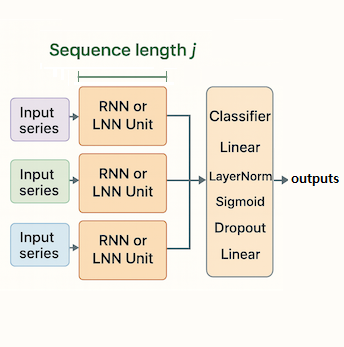

# Table of Contents

1. [Introduction](#introduction)
2. [Architecture Overview](#architecture-overview)
3. [Model Comparison](#model-comparison)
4. [Getting Started](#getting-started)
   * 1. Check the Running Environment
   * 2. Installation and Dependencies
   * 3. Download Datasets
   * 4. Configuration
   * 5. Training the Model


---


# 📑 Introduction {#introduction}

## Multi-Head Neural Networks for Financial Time Series Classification

This repository implements a multi-head architecture for bankruptcy prediction on financial time series. It uses recurrent models—LTC, CfC, LSTM, and GRU—to process multiple financial indicators in parallel, and includes various preprocessing techniques, undersampling methods to address class imbalance, and comprehensive evaluation metrics.


---


# 🔍 Architecture Overview {#architecture-overview}

## Multi-Head Architecture



The architecture employs a multi-head design where each financial variable is processed through its own dedicated network branch, with outputs subsequently combined for final classification.

> **Note:** Images and papers are [here](https://www.mdpi.com/1999-5903/16/3/79).

### 1. Liquid Time-Constant Networks (LTC)

Continuous-time recurrent network with liquid time constants. Uses the [ncps](https://github.com/mlech26l/ncps) library for implementation.

* **Paper:** [https://arxiv.org/pdf/2006.04439](https://arxiv.org/pdf/2006.04439)

---

### 2. Closed-form Continuous-time Networks (CfC)

Efficient continuous-time networks with closed-form solutions. Uses the [ncps](https://github.com/mlech26l/ncps) library with tanh activation.

* **Paper:** [https://arxiv.org/pdf/2106.13898](https://arxiv.org/pdf/2106.13898)

---

### 3. Long Short-Term Memory (LSTM)

Traditional recurrent network with memory cells.

---

### 4. Gated Recurrent Unit (GRU)

Simplified recurrent network with gating mechanisms.


---


# 📋 Model Comparison {#model-comparison}

## Model Parameters

| Model Type | Window Size |    Total Parameters    |
| :--------: | :---------: | :--------------------: |
|     LTC    |   3, 4, 5   |   1,170; 1,836; 2,646  |
|     CfC    |   3, 4, 5   | 39,384; 50,976; 62,568 |
|    LSTM    |   3, 4, 5   |   1,296; 2,016; 2,880  |
|     GRU    |   3, 4, 5   |    972; 1,512; 2,160   |
| Classifier |   3, 4, 5   |   3,778; 4,930; 6,082  |


---


# 🔨 Getting Started {#getting-started}

## 1. Check the Running Environment {#1-check-the-running-environment}

Verify your PyTorch installation:

```bash
python -c "import torch; print(torch.__version__); print('CUDA available:', torch.cuda.is_available())"
```

## 2. Installation and Dependencies {#2-installation-and-dependencies}

Clone the repository and install dependencies:

```bash
git clone https://github.com/gyb357/MultiHeadLNN
cd MultiHeadLNN
pip install -r requirements.txt
```

### Required Dependencies

* torch
* pandas
* matplotlib
* scikit-learn
* ncps
* rich
* pyyaml

## 3. Download Datasets {#3-download-datasets}

```bash
https://github.com/sowide/multi-head_LSTM_for_bankruptcy-prediction
https://github.com/sowide/bankruptcy_dataset
```

> **Note:** The dataset is under a CC-BY-4.0 license. Please refer to each repository's README.

## 4. Configuration {#4-configuration}

Modify `./config/configs.yaml` to customize your experiment.

## 5. Training the Model {#5-training-the-model}

### Data Preparation

Ensure your dataset is structured as:

```
dataset/{window}_train.csv
ataset/{window}_valid.csv
dataset/{window}_test.csv
```

### Running Training

```bash
python main.py
```

### Results

* Model checkpoints: `result/best_model.pth`
* Experimental results: `result/{ModelName}_results_{ScalerName}_{Threshold}.csv`
* To generate plots: `python plot.py`

